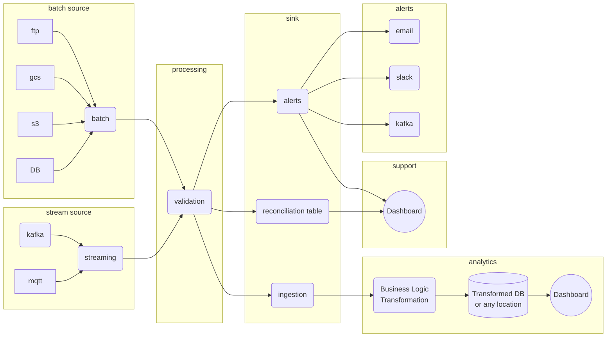

# Spark Use case
---

## Initial Block Diagram
---

```mermaid
graph LR
	subgraph batch source
    b(batch)
    ftp --> b
    gcs --> b
    s3 --> b
    DB --> b
  end
  subgraph stream source
    s(streaming)
    k(kafka) --> s
    mqtt --> s
  end
  subgraph processing
    b --> v(validation)
    s --> v
  end
  subgraph sink
    v --> a(alerts)
    v --> r(reconciliation table)
    v --> i(ingestion)
  end
  subgraph analytics
    i --> bl(Business Logic <br> Transformation)
    bl --> bdb[(Transformed DB <br> or any location)] 
    bdb --> db((Dashboard))
  end	
  subgraph alerts
    a --> ae(email)
    a --> asl(slack)
    a --> ak(kafka)
  end
  subgraph support
    a --> sDash((Dashboard))
    r --> sDash
  end
```